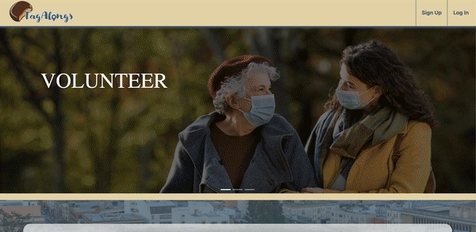
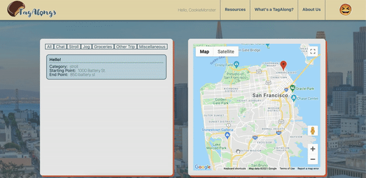
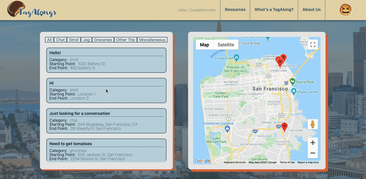
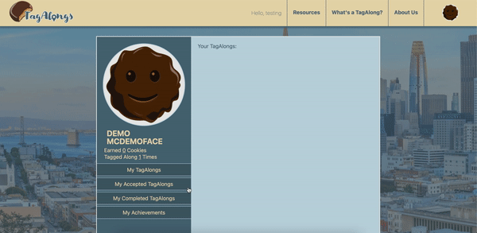
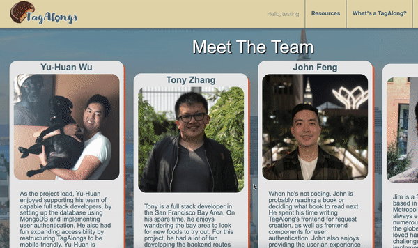

# TagAlongs
Companionship request app that strives to serve local communities.


## Background and Overview

TagAlongs is a volunteer-based buddy system that allows users to request companionship for a certain route or location. This is meant to help the elderly as well as anybody that does not feel safe walking around by themselves.

## Functionality and MVP

* User Authentication



* Create / Read / Update / Delete on requests



* Google Map API
```
<Map
    google={this.props.google}
    zoom={12}
    style={mapStyles}
    initialCenter={
    {
        lat: 37.762301,
        lng: -122.437640,
    }
    }
    >
    <Marker id="map-marker-css"
    onClick={this.onMarkerClick}
    name={items.startLocation}
    position={{
        lat: items.startLatLng[0],
        lng: items.startLatLng[1]
    }}
    />
    <Marker
    onClick={this.onMarkerClick}
    name={items.endLocation}
    position={{
        lat: items.endLatLng[0],
        lng: items.endLatLng[1]
    }}
    />
    <InfoWindow
    marker={this.state.activeMarker}
    visible={this.state.showingInfoWindow}
    onClose={this.onClose}
    >
    <div>
        <h4>{this.state.selectedPlace.name}</h4>
    </div>
    </InfoWindow>
</Map>
```

* Filter requests and update Map



* Upvote / Downvote Users



* Volunteer profile page and badges

* Mobile Friendly



## Technologies and Technical Challenges

* Frontend: React / Node.js
* Backend: MongoDB / Express
* API: Google Map

## Group Member and Work Breakdown

* Yu-Huan Wu - Team Lead and Backend/Frontend/Design Assistant
* Jim Nardi - Frontend Lead
* John Feng - Flex Developer
* Tony Zhang - Backend Lead


### Oct 11  - 15


Day 1 - Oct 11
* Start File structure - All
* Build backend User Auth - Tony
* Build frontend user Auth - Jim
* Build sign in/up front end forms - John
* Build wireframe for frontend design -Yu-Huan

Day 2 - Oct 12
* Build nav bar form and design splash page - Jim
* Finish auth forms and start frontend tagalongs component - John 
* Start working on CSS for form pages - Yu-Huan
* Start request model and google maps API - Tony

Day 3 - Oct 13
* Frontend tagalongs - John 
* Styling nav bar and other finished components - Yu-Huan
* Finish maps API and create routes for specific functions - Tony 
* Finish splash page and help with styling - Jim

Day 4 - Oct 14
* Design logo and cookie avatars - Yu-Huan
* Build about us page, WhatsATagAlong page, and resources page - Jim 
* Create routes for specific functions - Tony
* Design drop down menu and front end user profile - John


Day 5 - Oct 15
* Start ratings and add to footer - Tony 
* finish up some styling and making mobile friendly Yu-Huan/Jim
* Upvote and downvote cookies - John

